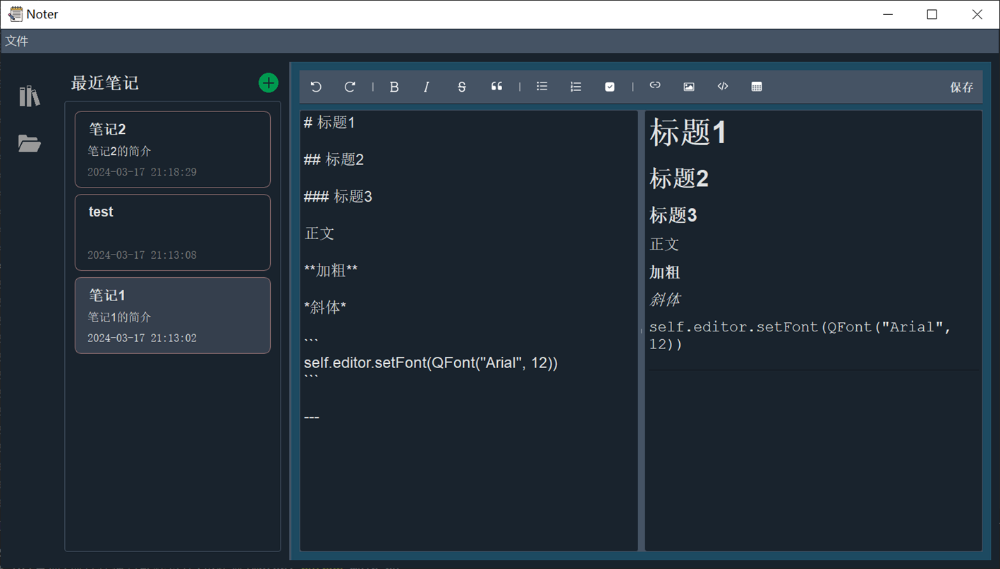

<h1>Noter</h1>

基于PyQt5的桌面Markdown笔记管理应用

## Demo

## TODO LIST

- [x] 最小化托盘
- [x] 中心布局拖拽
- [x] 添加笔记（本地）
- [x] 菜单栏日志
- [x] Markdown 编辑和预览
- [x] 笔记删除
- [x] 笔记重命名
- [x] 笔记导出md，html
- [ ] 笔记导出pdf
- [ ] 笔记名称和描述的输入限制，过长问题（中间栏的宽度？）
- [ ] 优化markdown渲染（很多扩展语法都还不支持）
- [ ] 自选笔记如何排序
- [ ] 用户登录
- [ ] 个性化设置（随时保存，界面外观主题）
- [ ] 笔记分类\标签\星标
- [ ] 回收站
- [ ] 笔记搜索
- [ ] 数据校验
- [ ] 数据 Github 远端同步（持久化）
