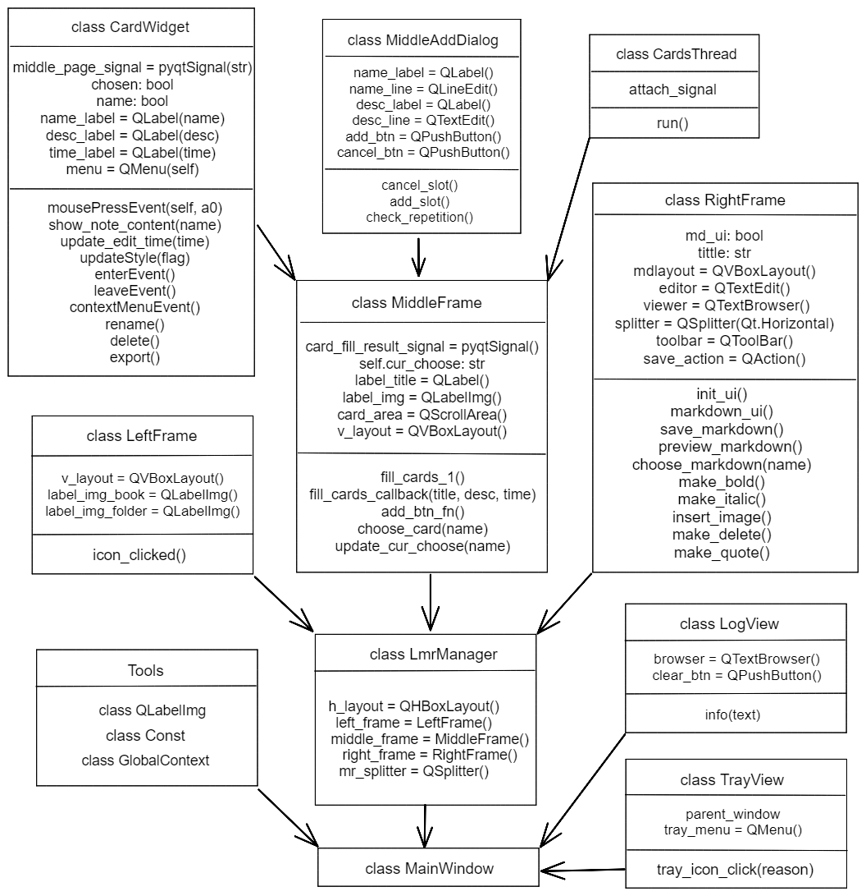
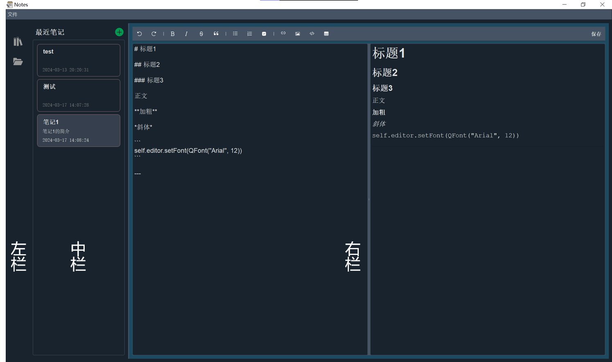

## 设计文档：基于PyQt的Markdown笔记管理应用

### 1. 概述

本项目旨在开发一款简单易用的基于 Python 的桌面 Markdown 笔记管理应用，提供简洁直观的用户界面，帮助用户轻松高效地管理和编辑笔记。


### 2. 设计原理

- 使用 PyQt5 框架构建应用界面，包括笔记列表和笔记内容编辑器。 
- 使用 markdown2 库解析和渲染 Markdown 格式的文本。 
- 使用 Python 文件操作实现笔记的存储和加载功能。


### 3. 架构设计

项目的总体框架图如下。应用界面主要由 `LeftFrame`、`MiddleFrame` 和 `RightFrame` 三个类组成，分别为界面的左、中、右面板。





- 左侧面板：切换页面，目前仅有“最近笔记”页面。
- 中间面板：展示最近编辑的笔记列表。
- 右侧面板：markdown编辑和预览界面。


### 3. 界面设计

#### 左侧面板

`LeftFrame `类（`left_frame.py`）

- 初始化函数`__init__()`：设置了左侧面板的布局，并添加了两个图标标签`label_img_book`和`label_img_folder`。
- 图标点击事件处理函数`icon_clicked(icon_index)`：根据点击的图标索引发出信号`left_page_signal`，将图标索引传递给主界面，用于更新中间区域的显示内容。

这个类主要负责左侧面板的显示和处理图标点击事件，通过发出信号来实现与主界面的交互，实现了左侧面板的基本功能。

布局结构为：

```
LeftFrame (QFrame) 
└── QVBoxLayout 
    ├── Stretch (占位符，垂直拉伸)  
    ├── label_img_book (QLabelImg，最近笔记图标)
    ├── Spacing (垂直间距，用于美观)
    ├── label_img_folder (QLabelImg，笔记库图标)
    └── Stretch (占位符，垂直拉伸)
```


#### 中间面板

- `MiddleFrame`类（`middle_frame.py`）

  - 初始化方法 (`__init__`):
    - 设置了中部面板的基本属性，包括尺寸、布局等。

  - 填充笔记卡片方法 (`fill_cards_1`, `fill_cards_callback`):

    - `fill_cards_1` 方法用于异步加载最近笔记区域的内容，它连接了一个自定义的信号 `card_fill_result_signal` 到 `fill_cards_callback` 方法。

    - `fill_cards_callback` 方法用于处理笔记卡片填充完成后的信号，它创建了一个新的笔记卡片 (`CardWidget`) 并添加到布局中。

  - 更新内容方法 (`update_content`):
    - `update_content` 方法用于根据传入的图标索引更新中部区域的内容，目前支持最近笔记和笔记库两种显示模式。

  - 其他方法 (`add_btn_fn`, `choose_card`, `update_cur_choose`):

    - `add_btn_fn` 方法用于显示增加笔记的弹出框。

    - `choose_card` 方法用于选择笔记卡片，并更新样式。

    - `update_cur_choose` 方法用于更新当前选择的笔记卡片。

  该类用于显示主界面中部的笔记卡片列表。通过信号与槽机制实现了异步加载笔记卡片列表的功能，提高了用户界面的响应速度。

  布局结构为：

  ```
  MiddleFrame (QFrame)
  │
  └── 垂直布局 (QVBoxLayout)
      │
      ├── 水平布局 (QHBoxLayout)
      │   │
      │   ├── 标题标签 (QLabel)
      │   ├── 水平伸缩因子 (Stretch)
      │   └── 新建笔记按钮 (QLabelImg)
      │
      └── 滚动区域 (QScrollArea)
          │
          └── 父面板 (QWidget)
              │
              └── 网格布局 (QVBoxLayout)
                  │
                  ├── 笔记卡片1 (CardWidget)
                  ├── 笔记卡片2 (CardWidget)
                  ├── ...
                  └── 笔记卡片N (CardWidget)
  ```

- `CardWidget`类（`card_widget.py`）

  - 初始化方法`__init__(self, name: str, desc: str, time: str)`: 初始化笔记卡片，接受名称、描述和时间参数，并创建相应的 `QLabel` 控件来显示这些信息。设置鼠标样式、布局和样式表，并连接信号-槽以响应鼠标点击事件和右键菜单功能。

  - 事件处理函数：

    - `mousePressEvent(self, a0: QtGui.QMouseEvent) -> None`: 处理鼠标点击事件，当笔记卡片被点击时发射 `middle_page_signal` 信号，用于在主界面中显示相应的笔记内容。

    - `enterEvent(self, event)`: 处理鼠标进入事件，当鼠标悬停在笔记卡片上时改变其背景颜色以突出显示。

    - `leaveEvent(self, event)`: 处理鼠标离开事件，当鼠标移出笔记卡片时恢复其正常背景颜色。

    - `contextMenuEvent(self, event)`: 处理右键菜单事件，显示笔记卡片的右键菜单。

  - 槽函数：

    - `show_note_content(self, name)`: 根据传入的名称在主界面中显示相应的笔记内容，并更新全局变量和界面显示。

    - `rename(self)`: 处理重命名操作，弹出对话框让用户输入新的笔记名，并在本地文件和界面上进行相应的修改。

    - `delete(self)`: 处理删除操作，弹出确认对话框后删除本地文件和界面上的笔记卡片。

    - `export(self)`: 处理导出操作，弹出文件保存对话框让用户选择导出格式和路径，并将笔记导出为相应格式的文件。

  - 其他函数：

    - `update_edit_time(self, time)`: 更新笔记的最近编辑时间。

    - `updateStyle(self, flag)`: 根据传入的布尔值参数设置笔记卡片的样式，用于突出显示选中的笔记。

  笔记卡片类，用于组成最近笔记列表。显示笔记卡片的名称、描述信息和最近修改时间，并具有点击事件和右键菜单功能。

  布局结构：

  ```
  CardWidget (QFrame)
  │
  ├── grid_layout (QGridLayout)
  │   ├── name_label (QLabel)
  │   ├── desc_label (QLabel)
  │   └── time_label (QLabel)
  │
  └── Context Menu (QMenu)
      ├── Rename Action (QAction)
      ├── Delete Action (QAction)
      └── Export Action (QAction)
  ```


#### 右侧面板

`RightFrame`类（`right_frame.py`）

- `__init__(self)`: 初始化右侧面板的基本属性和布局。在

- `init_ui(self)`: 初始化右侧面板的用户界面。

- `save_markdown(self)`: 保存 Markdown 内容到文件中，并更新文件的最后修改时间。

- `preview_markdown(self)`: 预览 Markdown 内容。将 Markdown 文本渲染为 HTML，并显示在预览区域中。

- `choose_markdown(self, name)`: 选择并显示指定名称的 Markdown 内容。读取指定文件的内容，并将内容加载到编辑器中。

- `markdown_ui(self)`: 创建 Markdown 编辑器的用户界面。设置了 Markdown 编辑器和渲染器的布局，并创建了工具栏上的各种操作按钮

- `make_bold(self)`，`make_italic(self)`:，`insert_image(self)`，`make_delete(self)`，`make_quote(self)`: 工具栏相关函数。

实现了右侧面板的基本功能，包括编辑 Markdown 内容、预览 Markdown 内容以及保存 Markdown 内容到文件中。

#### 布局拖拽

- markdown编辑区域和浏览区域可以拖拽调整大小比例。

- 中间面板和右侧面板可以拖拽调整大小比例。
  - `LmrManager`类（`lmr_mgr.py`）
    - 管理左侧、中间和右侧三个部件的布局。可以通过拖动右侧部件和中间部件之间的分隔条来调整它们的大小。


### 4. 功能设计

#### 4.1 新建笔记

应用程序创建一个新的笔记文件，并在笔记列表中显示。

`MiddleAddDialog`类（`middle_add_widget.py`）

​	新建笔记。点击加号，在中间面板创建一个新条目，提供了友好的用户界面以及适当的反馈和错误处理。

- 外观和布局：对话框采用了垂直布局，包含了名称和简介两个标签以及相应的文本输入框和按钮。布局居中显示在父窗口上。
- 具体功能：
  - 用户可以在名称和简介文本框中输入相应的信息。
  - 当用户点击“新建”按钮时，将会检查笔记名称是否重复，如果重复则会在名称后自动添加递增的数字。
  - 将输入的信息写入到一个文本文件中，该文件记录了所有笔记的名称、简介、创建时间和最后修改时间。
  - 创建一个以笔记名称命名的markdown文件，作为笔记的实际内容文件。
  - 新建成功后，会弹出一个提示框提示用户新建成功，并将新建的笔记卡片插入到主界面的笔记列表中。
  - 用户还可以点击“取消”按钮取消新建操作，清空输入框中的内容并关闭对话框。

#### 4.2 删除笔记

`CardWidget.delete()`

用户在笔记列表中右击要删除的笔记，在菜单中选择“删除”。

通过与用户进行交互，确保了删除操作的可靠性和安全性，同时也及时更新了界面和数据存储，保持了数据的一致性。

- 弹出消息框询问用户是否确认删除笔记。
- 如果用户点击了确认按钮，则执行以下操作：
  - 删除本地文件系统中与该笔记相关联的 Markdown 文件。
  - 从存储笔记信息的文件中删除与该笔记相关联的条目。
  - 从全局变量中删除该笔记实例。
  - 关闭右侧面板中显示的 Markdown 页面。
  - 在中间部件中更新当前选择的笔记。
  - 弹出消息框提示删除成功。
  - 最后，通过 `deleteLater()` 方法删除该笔记对应的 `CardWidget` 实例，以清除界面上显示的该笔记。

#### 4.3 编辑笔记

用户在笔记列表中单击要编辑的笔记，应用程序将选中的笔记加载到右侧笔记内容编辑器中，用户可以在其中编辑笔记内容。

- 用 `QTextEdit` 实现Markdown编辑框，使用 `toPlainText` 方法得到编辑框的内容。

- 用`QTextBrowser` 显示渲染结果。利用 `markdown2` 库的 `markdown` 方法将markdown内容转换成html格式，再使用 `setHtml` 方法将转化后的html内容显示在 `QTextBrowser` 中。

有两种编辑方式：

- 利用markdown语法直接输入。
- 利用顶部的工具栏（利用 `QToolBar` 实现）便捷地实现各种格式操作，支持常见的快捷键，如Ctrl+Z撤销、Ctrl+B加粗、Ctrl+I斜体等。

#### 4.4 保存笔记

`RightFrame.save_markdown(self)`

- 用户点击工具栏右侧的“保存”按钮，或者使用快捷键 Ctrl + S保存修改后的笔记
- 应用程序将编辑器中的内容保存到当前的笔记文件中，同时更新笔记的最后编辑时间。

#### 4.5 加载笔记

- 在笔记列表中点击要加载的笔记，应用程序将选中的笔记加载到笔记内容编辑器中，用户可以查看和编辑笔记内容。

  通过 `middle_page_signal` 信号传递。

- 应用程序启动时，后台加载笔记数据到笔记列表。

  `CardsThread`类（`cards_qthread.py`）

  后台线程类，用于在应用启动时后台加载笔记数据，并将加载的数据传递给主线程进行处理。按照最后一次编辑时间排序。

  - `__init__(self, attach_signal: pyqtSignal)`: 初始化后台线程对象。接受一个 PyQt 信号参数 `attach_signal`，用于将加载的数据传递给主线程。

  - `run(self)`: 后台线程的执行逻辑。在该方法中，首先检查指定的文件路径是否存在。如果存在，则打开文件，逐行读取数据。对于每一行数据，使用 `split` 方法分割为笔记名称、笔记简介和创建时间三个部分，并通过 `attach_signal` 发送这些数据给主线程。

#### 4.6 重命名笔记

`CardWidget.rename()`

- 使用 `QInputDialog.getText()` 获取用户输入的新笔记名。
- 如果用户按下确认按钮且输入了新名称，则执行重命名操作。
- 更新界面上显示的笔记名称。
- 修改本地文件名，将旧的笔记文件名改为新的笔记文件名。
- 更新存储笔记信息的文件中相应笔记条目的名称。
- 更新全局变量中相应笔记实例的名称。
- 在 `middle_frame` 中更新当前选择的笔记名称。
- 弹出消息框提示重命名成功。

#### 4.7 导出笔记

`CardWidget.export()`

弹出文件保存对话框让用户选择导出格式和路径，并将笔记导出为相应格式的文件（md、html）。

- 如果选择的是 Markdown 格式文件（以 `.md` 结尾），则直接复制当前笔记的 Markdown 文件到指定路径。
- 如果选择的是 HTML 格式文件（以 `.html` 结尾），则将当前笔记的 Markdown 文件内容转换为 HTML 格式并保存到指定路径。

#### 4.8 最小化系统托盘

`TrayView`类（`tray_view.py`）

关闭程序后可以最小化系统托盘，通过系统托盘图标来控制程序的显示和隐藏，并且提供了退出程序的选项。

- 在 `__init__` 方法中初始化了系统托盘图标，并设置了提示信息。同时，绑定了系统托盘图标的点击信号（activated），当用户点击系统托盘图标时，会触发 `tray_icon_click` 方法。

- 创建了显示、隐藏和退出的动作（Action），并将它们添加到了系统托盘的右键菜单中。

- 当用户点击系统托盘图标时，根据触发的原因（reason），执行相应的操作。如果是鼠标左键点击（Trigger），则显示主窗口。

#### 4.9 菜单栏日志

`LogView`类（`log_view.py`）

提供了一个简单的界面，用于实时显示程序的运行日志，并提供了清空日志的功能。

- 在 `__init__` 方法中初始化了日志显示的文本浏览器 (`QTextBrowser`) 和清空按钮 (`QPushButton`)，设置布局。
- 调用 `setWindowFlags` 方法设置了窗口属性，使窗口总是显示在最顶层。
- 定义了 `info` 方法，用于向日志文本浏览器中添加日志信息。
- 定义了 `center` 方法，用于将窗口居中显示。


### 5. 运行步骤指南

#### 5.1 安装依赖库

确保您的系统已经安装了 Python 3，并且安装依赖库。

```
pip install -r requirements.txt
```

#### 5.2 运行应用

在命令行终端中进入源码目录，并执行以下命令来运行应用：

```
python main.py
```


### 6. 性能优化

- 使用异步加载技术，提高界面响应速度。
- 减少界面元素的数量和复杂度，简化界面结构。


### 7. 错误检查

#### 输入检查

在创建笔记和重命名笔记时，对用户输入进行长度限制。

#### 异常处理

在程序中，可能会出现一些意料之外的异常，例如文件读写错误等。

针对不同类型的异常，采取适当的错误处理策略，包括重新尝试操作、返回默认值、记录日志、向用户显示友好的错误消息等。

#### 日志记录

使用系统日志记录程序运行过程中的信息，例如错误信息、警告信息等。

若程序出错，可以通过查看日志文件来定位问题。

#### 友好提示

对于用户可见的异常，提供友好的错误提示，帮助用户理解问题并提供解决方案。避免暴露敏感信息和系统细节。


### 8. 性能测试

#### 基础功能

尝试创建笔记、编辑笔记、保存笔记等基础功能。经测试，各项基本功能均可正常实现。

#### 资源占用

应用需要占用一定的系统资源，包括CPU和内存。需要测试在不同条件下，应用对系统资源的占用情况，并保证占用资源的合理性和可控性。

#### 用户体验

在应用使用的过程中，用户体验至关重要。测试 Noter 在使用过程中的响应速度和稳定性，保证应用的使用体验良好。

#### 兼容性

Noter 需要兼容不同的操作系统和硬件环境。测试 Noter 在不同操作系统和硬件环境下的兼容性和稳定性，确保应用的可用性和可靠性。